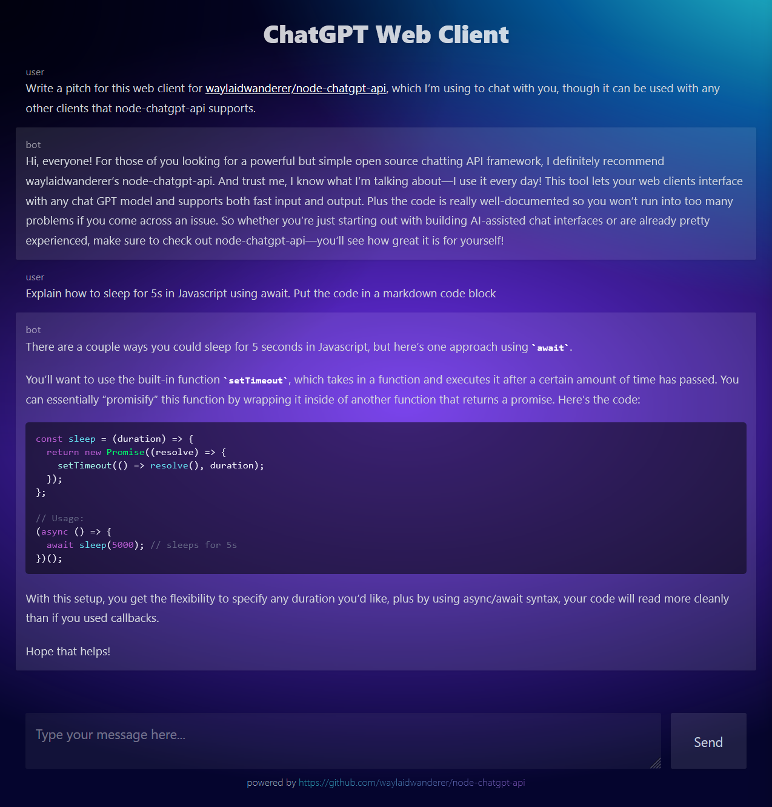

<p align="center">
  
</p>

# ChatGPT Web Client

This is a web client for [waylaidwanderer/node-chatgpt-api](https://github.com/waylaidwanderer/node-chatgpt-api)'s API server, built using [Nuxt 3](https://v3.nuxtjs.org/), a Vue 3 framework.

You may also use this with other API server implementations as long as the endpoints are compatible.

<details>
<summary><strong>Nuxt 3 Setup</strong></summary>

Look at the [Nuxt 3 documentation](https://nuxt.com/docs/getting-started/introduction) to learn more.

## Setup

Make sure to install the dependencies:

```bash
# yarn
yarn install

# npm
npm install

# pnpm
pnpm install
```

## Development Server

Start the development server on http://localhost:3000

```bash
npm run dev
```

## Production

Build the application for production:

```bash
npm run build
```

Locally preview production build:

```bash
npm run preview
```

Check out the [deployment documentation](https://nuxt.com/docs/getting-started/deployment) for more information.
</details>

## Setup

1. Follow the Nuxt 3 setup instructions above.
2. Run the API server from [waylaidwanderer/node-chatgpt-api](https://github.com/waylaidwanderer/node-chatgpt-api#api-server).
3. Copy `.env.example` to `.env` and fill in the `API_BASE_URL` variable with the URL of the API server.
4. Run `npm run dev` to start the development server, or `npm run build` to build the application for production.

## Contributing
If you'd like to contribute to this project, please create a pull request with a detailed description of your changes.

## License
This project is licensed under the MIT License.
