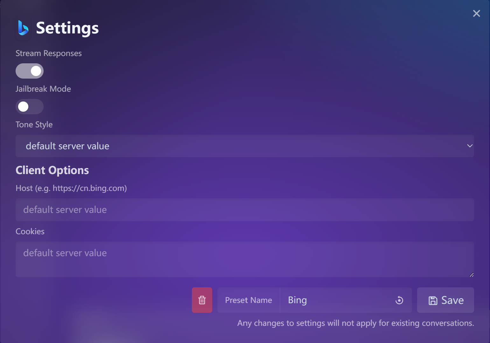
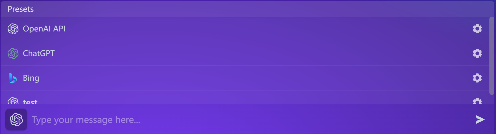

<p align="center">
  
</p>

# PandoraAI

PandoraAI is a web chat client powered by [node-chatgpt-api](https://github.com/waylaidwanderer/node-chatgpt-api), allowing users to easily chat with multiple AI systems while also offering support for custom presets. With its seamless and convenient design, PandoraAI provides an engaging conversational AI experience.

Built using [Nuxt 3](https://v3.nuxtjs.org/), a Vue 3 framework.  
You may also use PandoraAI with other API server implementations as long as the endpoints are compatible.

## Features

- Chat with all the AI that `node-chatgpt-api` supports, including `gpt-3.5-turbo`, `text-davinci-003`, ChatGPT, and Bing.
- Supports creating multiple presets for each client.  
 
- Choose between different clients or custom presets.  

- Everything is stored in local storage, so you can use this client without an account, and it can be imported or exported to other devices.
- Some extra features:
  - Support for deleting messages and copying Markdown sources
  - Support for rendering LaTeX formula
  - Typing preview
  - Dockerfile optimization
  - UI icon beautify
<details>
<summary><strong>Nuxt 3 Setup</strong></summary>

Look at the [Nuxt 3 documentation](https://nuxt.com/docs/getting-started/introduction) to learn more.

## Setup

Make sure to install the dependencies:

```bash
# yarn
yarn install

# npm
npm install

# pnpm
pnpm install
```

## Development Server

Start the development server on http://localhost:3000

```bash
npm run dev
```

## Production

Build the application for production:

```bash
npm run build
```

Locally preview production build:

```bash
npm run preview
```

Check out the [deployment documentation](https://nuxt.com/docs/getting-started/deployment) for more information.
</details>

## Setup

1. Follow the Nuxt 3 setup instructions above.
2. Run the API server from [node-chatgpt-api](https://github.com/waylaidwanderer/node-chatgpt-api#api-server).
3. Copy `.env.example` to `.env` and fill in the `NUXT_PUBLIC_API_BASE_URL` variable with the URL of the API server.
4. Run `npm run dev` to start the development server, or `npm run build` to build the application for production.
   1. If you see an empty white page after pulling the latest changes, run `nuxi upgrade --force` first and then `npm run dev`.

### Docker Setup
Build the image, such as `docker build -t pandora-ai .`.

Run:
```shell
docker run --name pandora-ai -it -d -p 3000:3000 -e NUXT_PUBLIC_API_BASE_URL=http://node-chatgpt-api/ pandora-ai
```

Make sure you override the `NUXT_PUBLIC_API_BASE_URL` environment variable.

## Contributing
If you'd like to contribute to this project, please create a pull request with a detailed description of your changes.

## License
This project is licensed under the MIT License.
